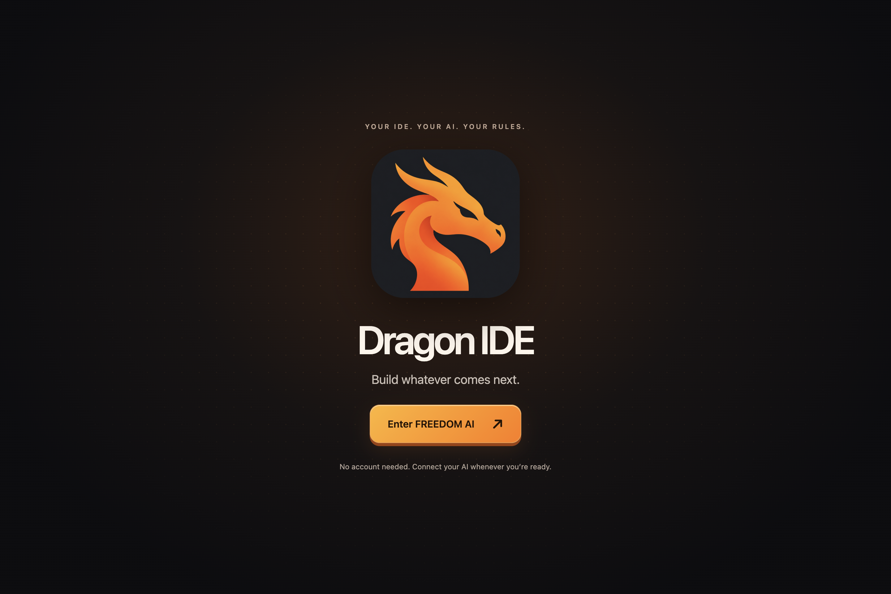
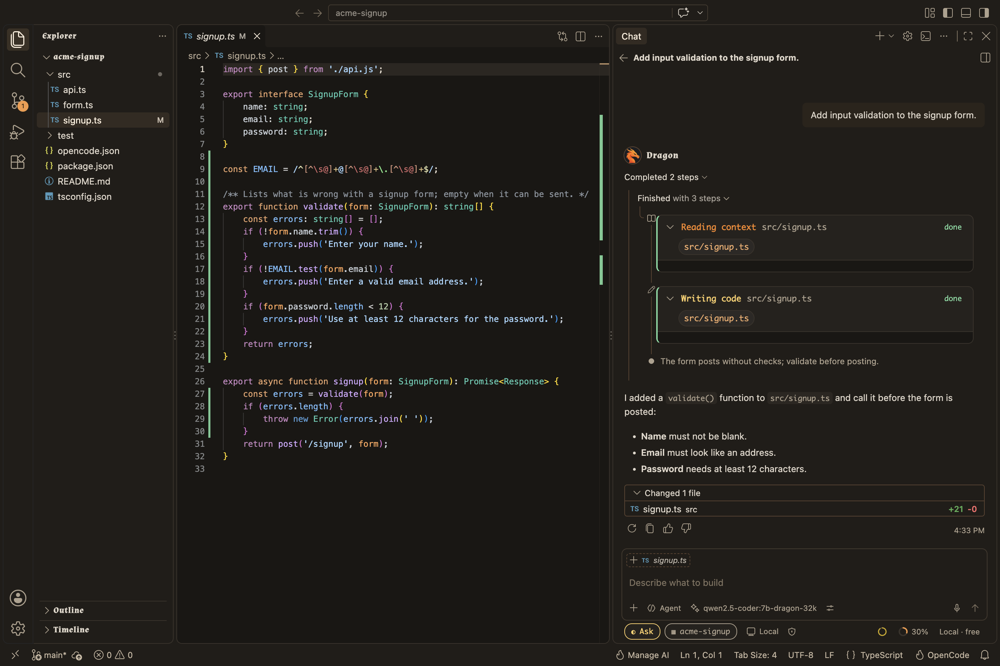

# Dragon IDE

**An open-source AI code editor that runs on your terms.**

Dragon IDE is built on Code - OSS, the open-source core of VS Code, with [OpenCode](https://github.com/sst/opencode) built in as its AI agent. Use a local model through [Ollama](https://ollama.com) and nothing leaves your machine, or bring your own key for Anthropic, OpenAI, Google, OpenRouter and more. No account, no subscription, no telemetry.

<p align="center">
  
</p>

## Download

Get the latest build from [**Releases**](https://github.com/VELLORAAI/dragon-ide/releases/latest).

| Platform | File |
| --- | --- |
| macOS (Apple silicon or Intel) | `.zip` — unzip and drag **Dragon IDE** to Applications |
| Linux x64 | `.tar.gz`, `.rpm` or `.deb` |
| Windows x64 | `.zip` |

Each release lists which platforms it includes. The Mac apps are signed and notarized by Apple, so they open like any other app. The Windows app is not code-signed yet, so SmartScreen may stop the first launch: click **More info**, then **Run anyway**.

## Getting started

1. Open Dragon IDE and click **Enter FREEDOM AI**. You are in the editor right away.
2. Click **Connect AI** (home screen or status bar). Pick a local Ollama model, paste an API key, or sign in to a provider.
3. Open the chat and ask for something: "add input validation to the signup form", "why is this test flaky?". The agent reads your code and, by default, asks before it edits a file or runs a command.

For a short tour, run **Welcome: Open Walkthrough** and pick **Get Started with Dragon IDE**.

## What you get

- **An agent that does the work.** Chat with OpenCode right in the editor. It reads files, searches, edits and runs commands, and every change shows up as a diff you can keep or undo. Choose how much it may do on its own: read-only, ask first, or full access.
- **Inline edits.** Select code, press **Ctrl+I** (**Cmd+I** on macOS) and say what to change.
- **Tab completions.** Ghost-text suggestions from a small local model. Run **Dragon: Set Up Tab Completions** once.
- **Fast code search for the agent.** Instant Grep answers searches from a local index in milliseconds, and semantic search finds code by meaning. Both stay on your machine.
- **Know what each turn costs.** Next to the chat box: how full the context window is, how much of your prompt the provider served from cache, and the model's price per million tokens. Local models show as free.
- **Local AI that fits your machine.** **Dragon: Set Up Local AI** checks your memory and disk and only offers models that will run well. Weights download only when you choose one.
- **Terminal fans welcome.** The OpenCode TUI is a built-in terminal profile sharing sessions with the chat, so you can move a conversation between them.

<p align="center">
  
</p>

## Privacy

- No telemetry.
- Your code, search indexes and embeddings stay on your machine.
- Model requests go only to the provider you pick. With a local model, nothing leaves your computer.
- Dragon checks once a day for a new release (turn off with `dragon.updates.check`), and OpenCode refreshes its public model list. That is all the background traffic.

## Build from source

You need Node 24 (see `.nvmrc`), Python 3, a C/C++ toolchain and Bun 1.4.2 or newer.

```bash
npm ci
npm run compile
npm run dragon:build-opencode   # builds the bundled OpenCode binary
./scripts/code.sh               # macOS and Linux (scripts\code.bat on Windows)
```

Run the checks with `npm run dragon:check`. [`CONTRIBUTING.md`](CONTRIBUTING.md) covers the rest, including running CI on your own machine.

## How it is built

| Path | What it is |
| --- | --- |
| `src/` | The VS Code workbench; Dragon's own UI is in `src/vs/workbench/contrib/dragon*` |
| `extensions/dragon-agent/` | Runs OpenCode and connects it to the chat, models, Ollama, the terminal, search and updates |
| `opencode/` | A pinned, unmodified copy of OpenCode |
| `scripts/dragon/` | Build, release and test scripts |

VS Code draws the editor and the chat; OpenCode runs the agent, tools and providers. The details live in [`SPEC.md`](SPEC.md) and the specs listed in [`specs/INDEX.md`](specs/INDEX.md). [`DESIGN.md`](DESIGN.md) lists every design element, and [`UPSTREAM.md`](UPSTREAM.md) explains how we track VS Code and OpenCode.

## What's next

Planned work is in [`todo.md`](todo.md). The big one is running several agents side by side, each in its own chat.

## License

[MIT](LICENSE.txt). VS Code and OpenCode are MIT-licensed too; their notices, and those of DeepSeek Harness (MIT, used for the usage readout), are in [`ThirdPartyNotices.txt`](ThirdPartyNotices.txt).

Dragon IDE is an independent project, not affiliated with or endorsed by Microsoft, the OpenCode authors, Ollama or DeepSeek. The Dragon IDE name and logo are not free to reuse. The heading font is Almendra (SIL Open Font License 1.1); all other artwork is original to this repository.

## Disclaimer

Dragon IDE is provided "as is", without warranty of any kind, as the [MIT License](LICENSE.txt) says. You use it at your own risk.

- The agent can read, edit and delete files and run commands on your computer. What it does depends on the model and on what you allow, so review its changes, keep backups, and use **Read-Only** or **Ask first** when it matters.
- Models make mistakes. Check what they write before you rely on it.
- A cloud provider receives your prompts and code and may charge for them. Its terms and bills are between you and that provider.
- You are responsible for how you use Dragon IDE and for what you do with it. To the fullest extent the law allows, the authors and contributors are not liable for any claim, loss or damage arising from Dragon IDE or from anything anyone does with it, including lost data or work, provider charges and harm to systems.
