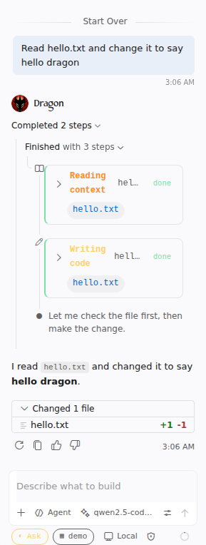

# Your agent is OpenCode

Ask **@dragon** in the chat. Every turn runs inside OpenCode, the open-source coding agent.

- **Agent** and **Edit** modes change code; **Ask** mode only reads and answers.
- Each tool call appears as a live card while it runs: reading, searching, editing, running commands.
- The agent's reasoning streams into the thinking block.
- When a turn changes files, you get a multi-file diff to review.
- To edit in place, select code and press **Ctrl+I** (**Cmd+I** on macOS). The change appears as an inline diff you can keep or undo.

